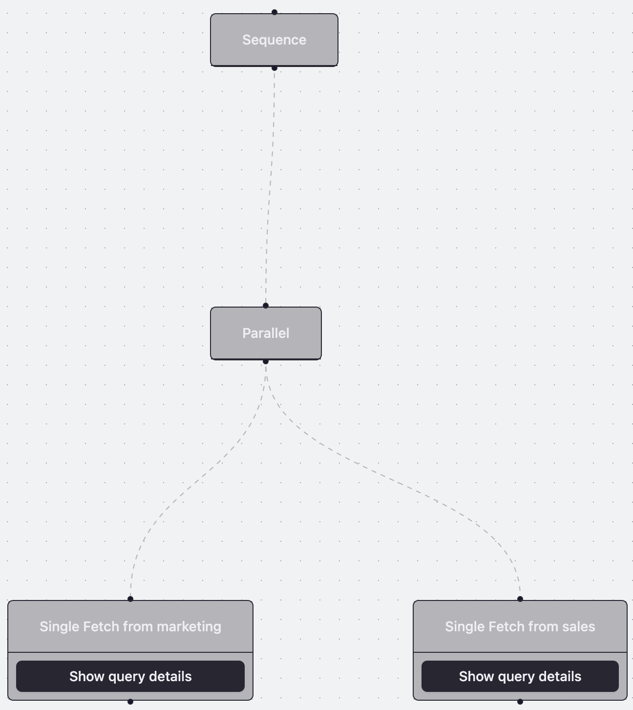
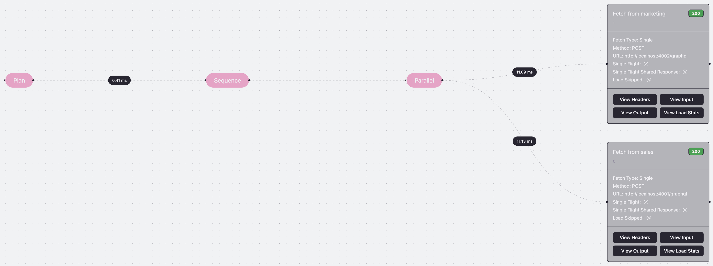
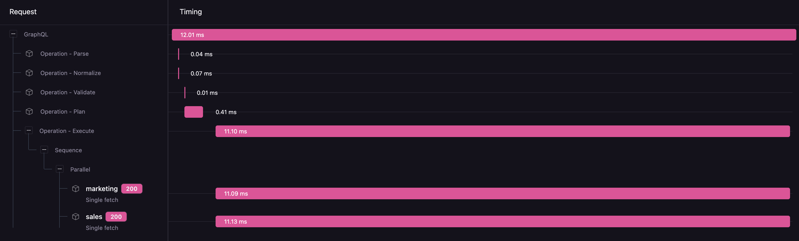
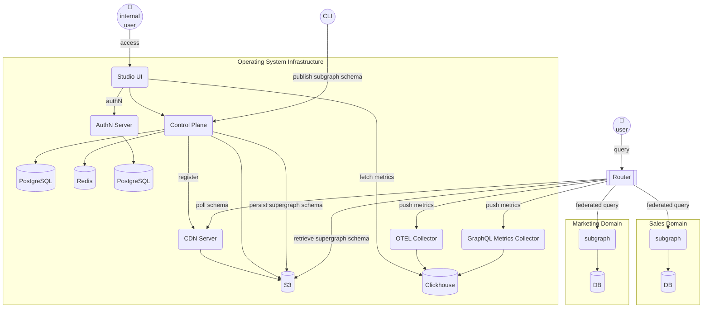

# wundergraph-supergraph

Wundergraph Supergraph Router setup

# 🚀 Onboarding Guide

## Prerequisites

- Node.js (v22+ recommended)
- pnpm
- Docker & Docker Compose

## Setup Steps

1. Clone the repository
2. Install dependencies: `pnpm i`
3. Start services: `make up`
4. Navigate to [http://localhost:4000](http://localhost:4000) to access the supergraph playground

## Key Technologies

- Node.js, NestJS (subgraphs)
- GraphQL Federation
- Docker Compose (local dev)

## Extensibility

- Add new subgraphs for additional domains
- Update router config for new services

# Visualizations

## Query Plan

## Request Trace: Tree View

## Request Trace: Waterfall View

# Architecture Overview

# Components Overview

| Component                 | Language | Connectors                                                                             | Dependencies                                        |
| ------------------------- | -------- | -------------------------------------------------------------------------------------- | --------------------------------------------------- |
| CDN Server                | TS       |                                                                                        | Control Plane, Config Storage                       |
| Config Storage            | N/A      | S3-compatible API (Cloudflare R2, AWS S3, GCS, Azure Blob, MinIO)                      | N/A                                                 |
| Control Plane             | TS       |                                                                                        | Studio, PostgreSQL, Redis, Clickhouse, AuthN Server |
| Studio                    | TS       |                                                                                        | Control Plane                                       |
| CLI                       | TS       |                                                                                        | Studio, Control Plane                               |
| AuthN Server              | Java     | Keycloak, IdPs SSO - Google, GitHub, or SAML                                           | Studio, PostgreSQL                                  |
| OTEL Collector            | Golang   | OpenTelemetry protocol, Observability platforms (Grafana, Prometheus, Jaeger, Datadog) | Router, Studio, Clickhouse, Prometheus              |
| GraphQL Metrics Collector | Golang   | OpenTelemetry protocol, Observability platforms (Grafana, Prometheus, Jaeger, Datadog) | Router, Studio, Clickhouse                          |
| Router                    | Golang   |                                                                                        |                                                     |
| Subgraph                  | Any      |                                                                                        | OTEL Collector, GraphQL Metrics Collector           |

# Deployment

### Stage

#### Stage 1: Router

Prerequisites:
- new service in the cloud provider

Process:
- deploy docker image as a service
- configure CI/CD pipeline to compose, persist, and deploy supergraph schema
- configure CI/CD pipeline to build and deploy Wundergraph Cosmo Router

Cons:
- lack of observability
- no metrics collection
- minimal schema registry
- no zero-downtime deployments

#### Stage 2: S3 Bucket

Prerequisites:
- new S3 bucket (Azure Blob Storage) in the cloud provider

Process:
- configure Router to Azure Blob Storage
- update CI/CD pipeline to build and deploy supergraph schema to S3 bucket

Cons:
- lack of observability
- no metrics collection
- minimal schema registry

#### Stage 3: Control Plane

Prerequisites:
- AuthN Server
- Studio UI
- Clickhouse
- PostgreSQL
- Redis