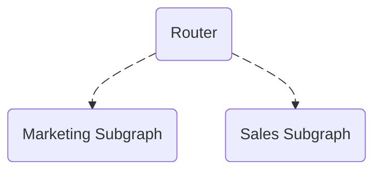

# Local Supergraph Schema File

This is a local supergraph schema file for WunderGraph Cosmo Router.

# 🚀 Onboarding Guide

## Prerequisites

- Node.js (v22+ recommended)
- pnpm
- Docker & Docker Compose

## Setup Steps

1. Clone the repository
2. Install dependencies: `pnpm i`
3. Start services: `make up`
4. Navigate to [http://localhost:4000](http://localhost:4000) to access the supergraph playground

## Project Structure

- `subgraphs/` - Domain-specific GraphQL services
- `router/` - Supergraph router config

# 📋 Architecture Overview

## System Components

- **Subgraphs**: Modular GraphQL services (e.g., marketing, sales)
- **Router**: Supergraph router for federated queries

## Architecture Diagram

## Key Technologies

- Node.js, NestJS (subgraphs)
- GraphQL Federation
- Docker Compose (local dev)

## Extensibility

- Add new subgraphs for additional domains
- Update router config for new services
