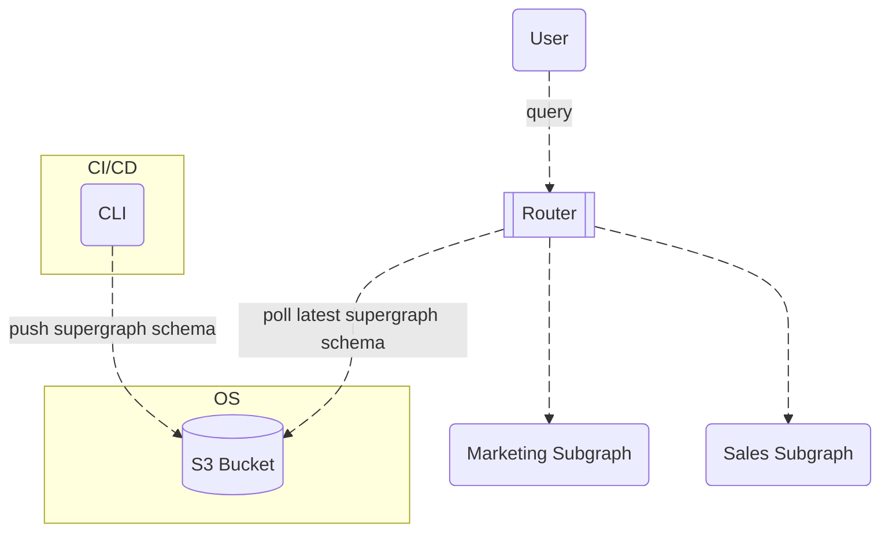

# S3 Bucket for Supergraph Schema

The S3 bucket is used to store the supergraph schema, allowing for easy access and management of the schema files.

# 📋 Architecture Overview

## System Components

- **Subgraphs**: Modular GraphQL services (e.g., marketing, sales)
- **Router**: Supergraph router for federated queries
- **S3 Bucket**: Storage for the supergraph schema

## Architecture Diagram

